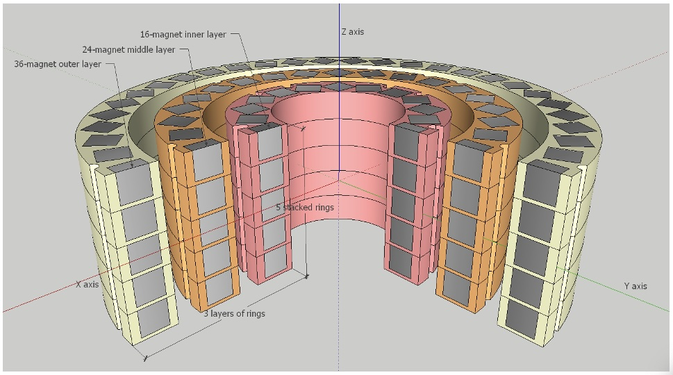
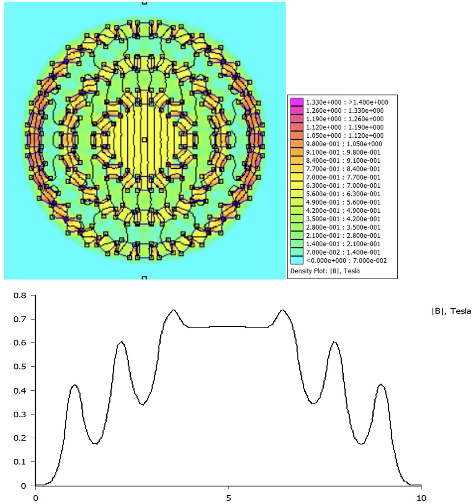
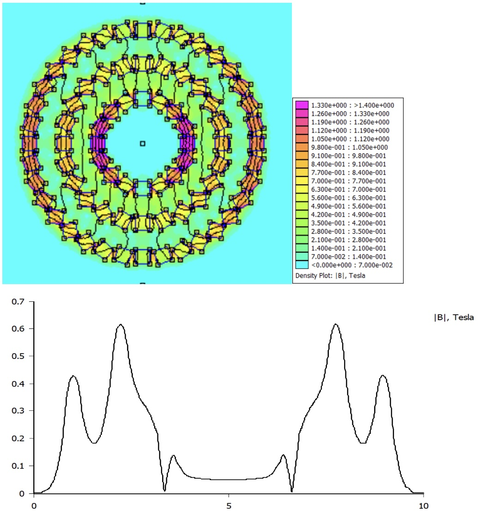

# Open Hardware Sweepable Halbach array

Floris Dekker, Julia Krug, Vittorio Saggiomo

IMPORTANT: THIS IS STILL A WORK IN PROGRESS

This research was done with the support of Open Science NL, Open Science Fund 23-1 - project OHEPR  

For NMR, MRI or EPR, a Halbach array cylinder has a few advantageous characteristics to use in the magnet design. In a perfect Halbach cylinder, the B0 inside is highly homogeneous, and stronger than without this array. The stray field on the outside on the other hand is quite weak. However, this assumes an infinitely long cylinder where the magnetic ring consists of an infinite amount of segments magnetized in a different direction. In practice this is not possible, but with sufficient height and enough rotated cube magnets, an approximation can be achieved. Using a single ring of cube magnets, this means there will be, theoretically, a trade off between homogeneity (more magnets = higher field homogeneity) and strength (more segments, i.e. more magnets with smaller size = lower field strength). 
In the case of EPR, the Halbach array cylinder offers another advantage.(1) For this technique it is necessary to sweep the magnetic field, and with multiple rings of Halbach cylinders, the net magnetic field can be changed by rotating the rings around each other. In order to prevent the direction of the magnetic field to change, two equally strong rings need to be rotated in opposite direction to cancel out the orthogonal components of the vector. Therefore, when constructing such a system, it is important to be able to construct two different sized rings that are equal in strength. As the simulated field strength does not accurately predict the B0 of the constructed ring, due to practical limitations, it is necessary to investigate the relation between the simulated and the real strength of B0.

### how did we get there? 

read [simulation and characterization](simulation.md) 

read [FEMM simulation](femm.md) 

go to the 3D printable [STL files](stl) for the 3 rings array 

### results 
For this experiment, a prototype is designed for a sweepable Halbach magnet that consists of 3 layers of 5 stacked Halbach array rings. Figure 1 shows the schematic for the design to clarify what is meant with layers and stacks, and to show the axes in relation to the magnet.

***Figure 1**. A cross-section of the EPR magnet showing the different Halbach rings. The magnet consists of 5 stacked rings with 16 magnets as the inner layer (shown in pink), 5 stacked rings with 24 magnets as the middle layer (light orange), and 5 stacked rings with 36 magnet (light yellow). The middle of the magnet is defined as (0,0,0) with the z axis (blue) running through the bore.*

***Figure 2**: Above the colour-scaled Flux density plot of the 3 ring Halbach with all 3 rings oriented in the same direction. Below, the magnetic field strength is plotted along the middle of the Halbach array (vertical line through the middle). The field strength at (0,0) is determined using FEMM simulation to be 0.666 T.*

*Figure 3: Above the colour-scaled Flux density plot of the 3 ring Halbach when the outer 2 rings are rotated 180 degrees in respect to the inner ring. Below, the magnetic field strength is plotted along the middle of the Halbach array (vertical line through the middle). The field strength at (0,0) is determined using FEMM simulation to be 0.048 T.*

###Further Experiments
In future, the stacked rings for 16-magnet rings should be measured using a more precise setup for the Hall meter. Additionally, the stacked magnet arrays with 24 and 36-magnet rings still need to be constructed and characterized in a similar fashion. 
When all three layers of stacked rings are constructed, the B0 field inside should be measured, as well as the influence of rotating the layers on the field. This can be compared to the simulation of a 3-layered system.
For all three different ring designs, it will be useful to simulate different diameter rings (keeping the same amount and size of magnets) to plot the relationship between diameter and field strength. A few real world designs can be made and characterized to compare to this plot. This way it will be possible to pick a desired field strength for each ring in further prototypes.

### Acknowledgment 

We thank Sander Baas for the support. 

references: 
(1) 1.	Bauer, C., Raich, H., Jeschke, G., & Blümler, P. (2009). Design of a permanent magnet with a mechanical sweep suitable for variable-temperature continuous-wave and pulsed EPR spectroscopy. Journal of Magnetic Resonance, 198(2), 222–227. https://doi.org/10.1016/j.jmr.2009.02.010 
