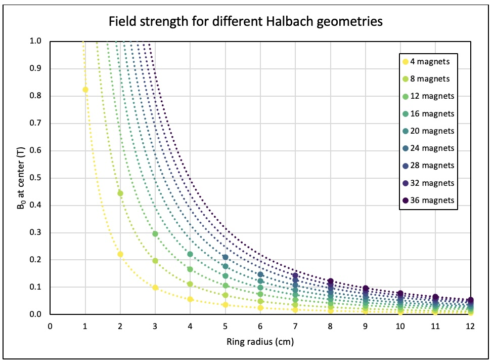
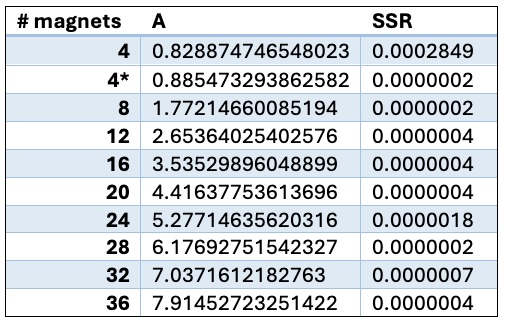
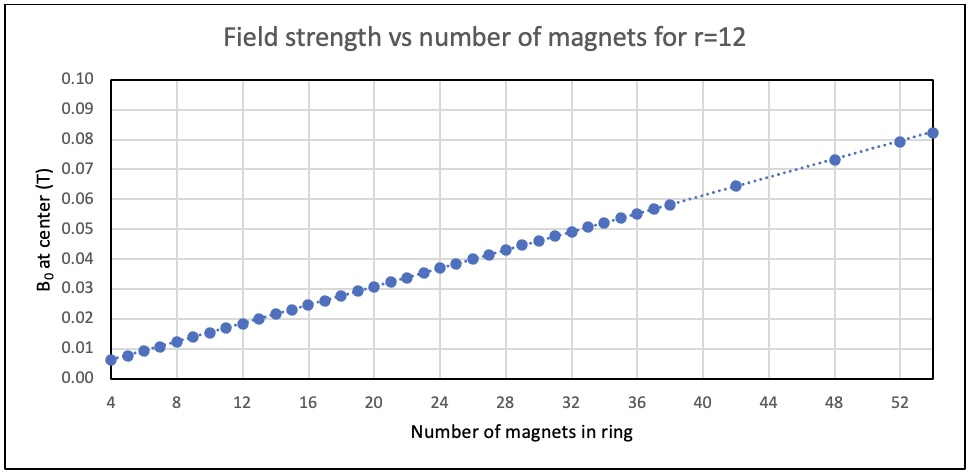

# Summary FEMM Simulation 

For construction of an EPR magnet with several layers of Halbach rings, it is important to accurately predict the field strength of an Halbach ring with a specific geometry. Using FEMM 4.2, Halbach rings with different parameters are simulated and compared for their field strength at the center (B0(0,0)). For a fixed size and material of square magnets, the B0(0,0) depends on the number of magnets in the ring and the radius and closely follows the following formula:  B0(0,0)=(#magnets*x)/r2, where r is the radius of the ring and x a number that depends on the magnetization and geometry of the magnets, among other things. This correlation between these parameters and the magnetic field strength can be used to more easily design a Halbach system suitable for EPR spectroscopy.

## Background

Electron Paramagnetic Resonance spectroscopy (EPR) depends on a magnetic field sweep at a fixed frequency. Therefore, an EPR system needs a way of regulating and changing the B0 field of the magnet. Most EPR setups use a secondary electromagnet for this, but there are different options for this. Bauer et al. (1)designed a magnet for EPR spectroscopy that works with three layers of stacked Halbach cylinders. By turning the rings, the magnetic field inside can either add up or (partially) cancel out to modulate the magnetic field. 
An Halbach array cylinder has the advantage that the magnetic field inside is relatively strong and homogeneous. In the EPR system from Bauer et al.(1) a field homogeneity of ~1000 ppm is reached, which is homogeneous enough for EPR spectroscopy. Because EPR spectroscopy often uses a microwave generator that operates at a very precise wavelength, it is important to design the magnet with the necessary field strength so that the electron resonance frequency matches that of the microwave generator.
For such a design, there are 2 parameters that can be very easily adjusted to influence the strength of the B0 field: the radius of the cylinder and the number of magnets used. The correlation between these factors and B0, can be investigated using simulation software. FEMM 4.2 is such a simulation software for magnetic fields. While it reduces the setup to 2 dimensions, and this ignores effects such as the ends of a 3D cylinder, its ease of use and fast results make it a useful tool to explore the different geometries of 2D Halbach rings, and their field strengths. 

## Materials and methods
For the simulation of Halbach rings, FEMM 4.2 was used. A custom script is written for the construction of a Halbach array with different parameters. For each simulation, a Halbach ring was constructed with 1x1 square magnets made of N50 sintered NdFeB magnets. As Halbach arrays scale linearly, distance is a dimensionless number in the simulation but it is assumed to be in cm.
The field strength of each ring is determined by picking the center of the ring (0,0) and reading out the field strength in Tesla at these coordinates.

## Results and discussion
###Influence of ring radius on field strength

For a given number of magnets, rings with different radii were simulated. A series of rings were made for 4, 8, 12, 16, 24, 28, 32, and 36 magnets. The radii ranged from 1 cm to 12 cm, although the amount of magnets in the ring put restrictions on the minimum radius for some series. The results of these simulations are shown in Figure 1. The field strength at (0,0) for a Halbach ring with varying radius and number of magnets in the ring. All simulations used 1x1cm square magnets made out of N50 NdFeB. The dotted lines are fitted trendlines for each series of radii. For the rings with more magnets, the data starts at a higher radius, because otherwise the magnets would overlap.

 
***Figure 1**. The field strength at (0,0) for a Halbach ring with varying radius and number of magnets in the ring. All simulations used 1x1cm square magnets made out of N50 NdFeB. The dotted lines are fitted trendlines for each series of radii. For the rings with more magnets, the data starts at a higher radius, because otherwise the magnets would overlap.*

For a ring with differing radius, the internal area depends on the r2. If the ring contains a fixed amount of magnets, the total magnetic field is constant, only spread out over a different area. The simulated results of Figure 1 were therefore fitted with the following formula: B_0 (0,0)=A/r^2  with r the radius of the ring and A a varying number. The value of A was determined by comparing the calculated data with the simulated one, taking the sum of the residual squared (SSR) and minimizing this by varying the value of A. For every series except for the 4 magnet rings, SSR  was less  than 0.000001 indicating a very close fit. Since the simulation, based on the finite element method, is not a perfect simulation of reality but a proximation with several iterations, this value of SSR could well be due to the limitations of the simulation. 

For the 4 magnet series, the B0 differs from the expected value at r=1. This is also the only simulated ring where the magnets exactly touch. If this data point is left out because of this unique condition, the SSR approaches 0 for this series too. In Table 1 the value of A for each series is given, as well as the SSR.

**Table 1**. The different values of A for Halbach rings with different numbers of magnets, and the sum of the squared residual. 4* is without the ring of 1 cm.*

###Correlation of number of magnets and field strength

The value of A for the different ring series depends on the number of magnets in the ring. A quick glance on the values in Table 1 suggests a linear correlation between the number of magnets and the value of A. This makes sense. If every magnet generates an equally strong magnetic field, the total field strength is just the result of adding all these individual contributions together. 
But this is only true if every magnet in a Halbach array contributes equally to the internal magnetic field, regardless of orientation in the ring. To test this hypothesis, a series of rings were simulated with a fixed radius (12 cm), but with different numbers of magnets in the ring. Similarly to previous experiment, the field strength was determined by looking at the B0 at coordinates (0,0). These results are shown in Figure 2.

***Figure 2**. The field strength at (0,0) for a Halbach ring with a fixed radius of 12 cm vs the number of magnets in the ring. The minimum amount for a Halbach array ring is 4 magnets and for more than 55 magnets at this radius, the magnets would overlap. A linear trendline is plotted (dotted line) to fit the data. *

A linear trendline is fitted by plotting a fit function (B0=#magnets*A), calculating the difference between the simulated data and minimizing the sum of the squared residual by varying A. This gives a value of A=1.5328*10-3, meaning that every magnet would contribute 1.5328 mT to the B0 at (0,0).
If this formula would be a perfect fit the following would be true:  (B_0 (0,0))/(A*#magnets)=1.  However, calculating this for every data point, the true value ranges from 1.0056 at Nmagnets=4 to 0.9913 at  Nmagnets=55. So while this formula can predict the field strength within an error margin of 1%, it is not a perfect description of the B0, and it seems that with more magnets, the individual contribution slightly decreases.

##Conclusion 
A custom script was written to easily construct Halbach rings in FEMM 4.2 with the desired parameters. With this, a comparison was made between the radius and number of magnets of the Halbach ring vs the magnetic field strength at the center. A relation was found between the field strength at the center and the radius of the ring according to the following equation:
B_0 (0,0)=x/r^2  						(1)
Where x is an unknown value differing in between Halbach geometries.
Plotting the B0 against the number of magnets in the ring gives an almost linear relation for a fixed diameter. Combining this knowledge with equation 1, we get the following equation to approximate the field strength at the center for a 2D Halbach 
B_0 (0,0)≈(N_magnets*x)/r^2 					(2)
Here x certainly depends on multiple factors, such as the material of the magnets, the shape of the magnets, and probably other factors. Considering square magnets of 1x1 cm NdFeB N50 magnets, the value of x is found to be 1.5328*10-3. While this is not a perfect description of the Halbach ring, it can be used for a reasonably accurate prediction.
Future Perspective
To further enable the design of a Halbach setup for EPR, it is important to look at the influence of the radius and number of magnets on the homogeneity of the field, and to look at the influence of magnetic material on these factors. This can be done using the same simulation and script for designing the Halbach rings. 
A more time consuming, but equally important part will be to link real life measurements of Halbach cylinders to the simulated results. Here, imperfect magnetization and magnet placement, as well as end effects introduced by a 3rd dimension will influence the results. It might be useful to look at different simulation software to investigate these effects. Microwave studio is a simulation software that is 3 dimensional, which makes it possible to study the influence of end effects of a 3d Halbach cylinder. The disadvantage is that simulating this costs a lot of computing power. 
Another aspect which is needed at some point regardless is constructing cylinders with different geometries to relate the real world results with simulated values. If there proves to be a relatively fixed factor as a difference between these two, it will already be much easier to design an EPR magnet that can operate in the desired range of field strength.

go to [FEMM script ](Halbach_construction_Open.lua)

references: 
(1) 1.	Bauer, C., Raich, H., Jeschke, G., & Blümler, P. (2009). Design of a permanent magnet with a mechanical sweep suitable for variable-temperature continuous-wave and pulsed EPR spectroscopy. Journal of Magnetic Resonance, 198(2), 222–227. https://doi.org/10.1016/j.jmr.2009.02.010 