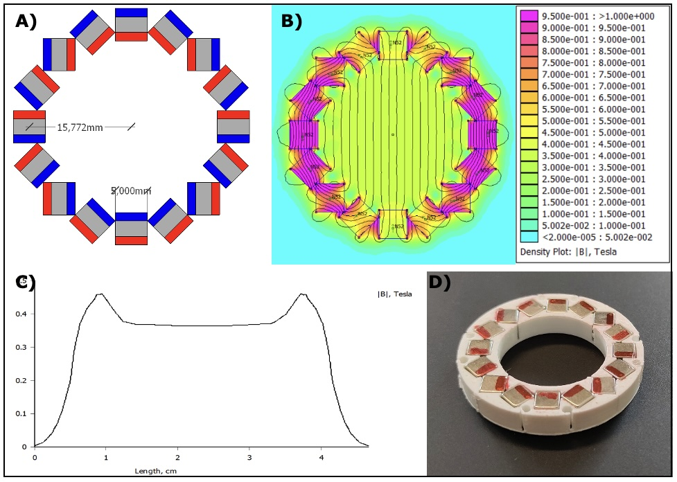

# Simulation of the different Halbach Arrays

To investigate the accuracy of the simulation, a comparison is made between 3 simulations and their constructed counterparts. 
Case 1 is a ring that consists of 16 magnets and is designed to maximize the field strength, that is with the smallest possible diameter. A design is made that fulfills these criteria, and is then simulated. After this, the Halbach holder is 3d printed with PLA and constructed with NdFeB cube magnets of 5mm. This ring is then tested with a Hall magnetometer to determine the actual field strength. 
Case 2 is a ring consisting of 24 magnets. Considering the final design of the three ring EPR magnet, the design is not chosen to minimize the diameter. Instead a diameter is chosen that can be easily fitted in between the two other rings. Case 1 and 3 are designed with a minimal diameter possible for their geometry. Case 2 is chosen to have a diameter precisely in between this, which means that it is somewhat larger than the minimal possible. A design is made that fulfills these criteria, and is then simulated. After this, the Halbach holder is 3d printed with PLA and constructed with NdFeB cube magnets of 5mm. This ring is then tested with a Hall magnetometer to determine the actual field strength.
Case 3 is a ring that consists of 36 magnets and is designed to maximize the field strength (and thus smallest possible diameter). A design is made that fulfills these criteria, and is then simulated. After this, the Halbach holder is 3d printed with PLA and constructed with NdFeB cube magnets of 5mm. This ring is then tested with a Hall magnetometer to determine the actual field strength. 
Figures 1, 2, and 3 show the design of the separate cases as well as the results of the simulation and the measurements for the 16-magnet, 24-magnet, and 36 magnet cases, respectively.

***Figure 1** A) A Halbach array containing 16 cube magnets of 5mm. The array is designed to have a minimal diameter, so that the corners of the cubes touch. This results in a radius (measured from magnet center to magnet center) of ~15.772 mm. B) Simulated magnet field of the Halbach array, using FEMM 4.2. The magnets used are N52 NdFeB square magnets. Since the simulation is 2-dimensional, an infinitely long cylinder is assumed. At (0,0) in the center of the array, the simulated B0 is 0.3624 T. C) A plot of the magnetic field density of the simulated Halbach array, running along the center of the array, parallel to the B0 field. D) Picture of the constructed Halbach ring, based on the schematic of figure 1A. The magnets used are a single layer of 5mm cube magnets made from N52 NdFeB.*

***Figure 2** A) A Halbach array containing 24 cube magnets of 5mm. The array is designed with a radius precisely in between the 16 and 24 magnet design. This results in a radius (measured from magnet center to magnet center) of ~27.861 mm. B) Simulated magnet field of the Halbach array, using FEMM 4.2. The magnets used are N52 NdFeB square magnets. Since the simulation is 2-dimensional, an infinitely long cylinder is assumed. At (0,0) in the center of the array, the simulated B0 is 0.1753 T. C) A plot of the magnetic field density of the simulated Halbach array, running along the center of the array, parallel to the B0 field. D) Picture of the constructed Halbach ring, based on the schematic of figure 2A. The magnets used are a single layer of 5mm cube magnets made from N52 NdFeB. *

***Figure 3** A) A Halbach array containing 36 cube magnets of 5mm. The array is designed to have a minimal diameter, so that the corners of the cubes touch. This results in a radius (measured from magnet center to magnet center) of ~39.949 mm. B) Simulated magnet field of the Halbach array, using FEMM 4.2. The magnets used are N52 NdFeB square magnets. Since the simulation is 2-dimensional, an infinitely long cylinder is assumed. At (0,0) in the center of the array, the simulated B0 is 0.1280 T. C) A plot of the magnetic field density of the simulated Halbach array, running along the center of the array, parallel to the B0 field. D) Picture of the constructed Halbach ring, based on the schematic of figure 3A. The magnets used are a single layer of 5mm cube magnets made from N52 NdFeB.*

## Measuring Field Strength with Hall sensor
For each ring size (16, 24, and 36 magnets), 5 rings were constructed. Using the handheld hall magnetometer from metrolabs, the strength of each ring was measured by moving the sensor through the middle of the ring and noting down the maximum recorded strength. To account for temperature fluctuation during the measurement, each measurement was repeated twice after all rings had been measured. The results of these measurements are given in Table 1:

## Characterization of stacked ring
A holder was printed for the 5 16-magnet rings to stack the layers. The holder was designed in such a way that the rings are fixated on top of each other with minimal distance, and to prevent rotation of the individual rings. After stacking the rings on top of each other, with poles in the same direction, the stacked ring was measured along the z-axis using the Metrolabs magnetometer. The result of this is shown in Figure 4.

***Figure 4**. The field strength measured along the central z-axis of a stacked Halbach ring. The ring consists of 5 16-magnet rings on top of each other, oriented in the same direction. The distance between the magnets in the z-direction is 0.6mm. The magnetic field profile shows a relatively symmetric curve of the field strength, yet there is no homogeneous plateau in the middle. Since the individual contribution of the Bx and By field is dependent on the arbitrarily used rotation of the Hall sensor, the total B0 is the most important value. The non-zero value of Bz indicates a small offset between the stage and the Halbach array.*

## Discussion and Conclusion
Comparing the simulations of the three different ring designs, the magnetic field becomes weaker, if the diameter of the ring becomes larger. This is to be expected. While a Halbach array can be scaled up without changing the magnetic field strength, a larger ring using more, evenly-sized magnet cubes, becomes relatively thinner and thus becomes weaker. In real life, the difference becomes even larger, as not only do the rings get thinner, the ratio between height and diameter also becomes smaller, deviating further from the simulated infinite cylinder. The 16-magnet ring reaches ~23% of the simulated field strength, for the 24-magnet ring and the 36-magnet ring this is only ~13% and ~9% respectively. 

The measurement of the stacked ring shows that the field strength already drastically increases when 5 rings are stacked on top of each other. The maximum B0 increases from ~23% of the simulated field strength to ~71% (257 mT). Stacking more rings on top of each other will most likely increase this further, but will yield diminishing returns. Noteworthy, the magnets in the rings are not touching, but separated in the z-direction because of the design of the 3d printed holders. Even if one would extend the cylinder infinitely, the magnets would only occupy 89% of the possible space, so it is unlikely that the field strength would reach higher than 89% of the simulated field using the current design.

